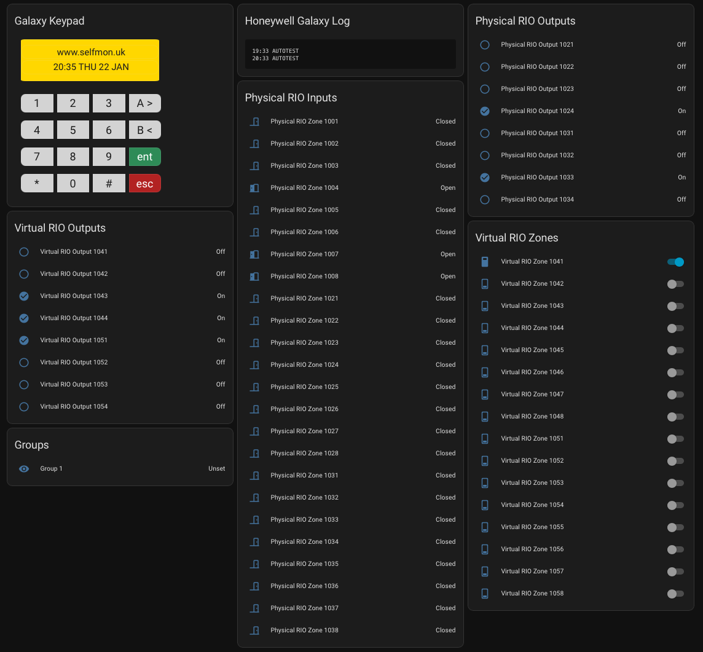

# Honeywell Galaxy Home Assistant Integration

This Home Assistant custom integration provides support for Honeywell Galaxy security alarms via MQTT using the
SelfMon VMOD available from http://www.selfmon.uk/sales/

## Credits

Jason Ball for the keypad card layout used in the template

Guy Wells for the inspiration and his integration for the Galaxy with VMOD https://github.com./guybw/selfmon-HA


## Features

- **Virtual Keypad**: Alarm control panel with display lines and 16-button interface
- **Virtual Printer**: Sensor for printer log messages with print service
- **Virtual RIO Zones**: Switches to control virtual zones (OPEN/CLOSED)
- **Virtual RIO Outputs**: Binary sensors for virtual output states (On/Off)
- **Physical RIO Zones**: Binary sensors for physical zone states (door, motion, smoke, etc.)
- **Physical RIO Outputs**: Binary sensors for physical output states (On/Off)
- **Groups**: Sensors showing system group set status (Set, Unset, Part Set, Night Set)
- **Automatic Discovery**: Automatically discovers zones, outputs, and groups from MQTT topics
- **Automatic Dashboard Cards**: Automatically creates Lovelace cards for all entities

|   


## Requirements

Before installing this integration, ensure you have:

1. **MQTT Server**: A working MQTT broker (e.g., Mosquitto) configured in Home Assistant
2. **HACS Custom Cards** (installed via HACS):
   - `button-card` by RomRider
   - `stack-in-card` by custom-cards
3. **VMOD Installed**: The SelfMon VMOD installed and sensors and outputs triggered to populate the MQTT topic paths

The custom cards are required for the automatically generated keypad interface.

## Installation

### HACS (Recommended)

1. Open HACS in Home Assistant
2. Go to "Integrations"
3. Click the three dots menu and select "Custom repositories"
4. Add this repository URL
5. Search for "Honeywell Galaxy" and install
6. Restart Home Assistant

### Manual Installation

1. Copy the `honeywell_galaxy` folder to your `custom_components` directory in Home Assistant
2. Restart Home Assistant
3. Go to Settings > Devices & Services
4. Click "Add Integration" and search for "Honeywell Galaxy"

## Configuration

1. Create a new dashboard called SelfMon or Security and make viewable in the left menu 
2. Go to Settings > Devices & Services
3. Click "Add Integration"
4. Search for "Honeywell Galaxy"
5. Enter your MQTT connection details:
   - **Host**: MQTT broker hostname or IP address
   - **Port**: MQTT broker port (default: 1883)
   - **Protocol**: mqtt, mqtts, ws, or wss
   - **Username**: (optional) MQTT username
   - **Password**: (optional) MQTT password
   - **VMOD ID**: Your VMOD identifier

After configuration, the integration will:
- Automatically discover Physical RIO zones and outputs from MQTT topics
- Automatically discover Virtual RIO zones and outputs from MQTT topics
- Automatically discover Groups from MQTT topics
- Automatically create Lovelace dashboard cards for:
  - Galaxy Keypad (with display lines and all buttons)
  - Honeywell Galaxy Log (printer log)
  - Physical RIO Inputs (zones)
  - Physical RIO Outputs
  - Virtual RIO Zones
  - Virtual RIO Outputs
  - Groups

## MQTT Topics

The integration uses the following MQTT topic structure:

- Virtual Keypad: `selfmon/vmod.{vmodid}/vkp`
  - Display Line 1: `selfmon/vmod.{vmodid}/vkp/display/line1`
  - Display Line 2: `selfmon/vmod.{vmodid}/vkp/display/line2`
  - Key Commands: `selfmon/vmod.{vmodid}/vkp/key`

- Virtual Printer: `selfmon/vmod.{vmodid}/vprinter`
  - Log Messages: `selfmon/vmod.{vmodid}/vprinter/log`
  - Print Commands: `selfmon/vmod.{vmodid}/vprinter/print`

- Virtual RIO Zones: `selfmon/vmod.{vmodid}/vrio/inputs/write/{zone_number}`
  - Commands: `OPEN` or `CLOSED`

- Virtual RIO Outputs: `selfmon/vmod.{vmodid}/vrio/outputs/{output_number}`
  - States: `ON` or `OFF`

- Physical RIO Zones: `selfmon/vmod.{vmodid}/prio/inputs/read/{zone_number}`
  - States: `OPEN` or `CLOSED`

- Physical RIO Outputs: `selfmon/vmod.{vmodid}/prio/outputs/{output_number}`
  - States: `ON` or `OFF`

- Virtual RIO Zones (Read): `selfmon/vmod.{vmodid}/vrio/inputs/read/{zone_number}`
  - States: `OPEN` or `CLOSED`

- Groups: `selfmon/vmod.{vmodid}/sia4/groups/{group_number}`
  - States: `Set`, `Unset`, `Part Set`, or `Night Set`

## Services

### `honeywell_galaxy.print_text`

Print text to the virtual printer.

**Service Data:**
- `text` (required): The text to print

**Example:**
```yaml
service: honeywell_galaxy.print_text
data:
  text: "Alarm triggered at {{ now() }}"
```

## Entities

After configuration, the integration automatically discovers and creates the following entities:

- **Sensors**:
  - Keypad Display Line 1 (shows the top line of the keypad display)
  - Keypad Display Line 2 (shows the bottom line of the keypad display)
  - Printer Log (stores last 10 log lines, full log available in attributes)
  - Groups (one per discovered group, showing Set/Unset/Part Set/Night Set status)

- **Buttons**: 16 Virtual Keypad buttons (1-9, 0, A>, B<, *, #, Enter, Escape)

- **Switches**: 
  - Virtual RIO Zones (automatically discovered, controllable switches for OPEN/CLOSED)

- **Binary Sensors**: 
  - Physical RIO Zones (automatically discovered, shows Open/Closed)
  - Physical RIO Outputs (automatically discovered, shows On/Off)
  - Virtual RIO Outputs (automatically discovered, shows On/Off)

All entities are automatically discovered from MQTT topics - no manual configuration required!

## Keypad Interface

The Virtual Keypad provides 16 buttons that match the physical keypad layout:
- **Row 1**: 1, 2, 3, A>
- **Row 2**: 4, 5, 6, B<
- **Row 3**: 7, 8, 9, Enter (green)
- **Row 4**: *, 0, #, Escape (red)

Each button press publishes the corresponding key value to the MQTT topic `selfmon/vmod.{vmodid}/vkp/key`.

### Automatic Keypad Card

The integration automatically creates a "Galaxy Keypad" card on your default Lovelace dashboard. This card includes:
- **Display Line 1** and **Display Line 2** at the top (yellow background, monospace font)
- **16 buttons** arranged in a 4x4 grid matching the physical keypad layout

The card is automatically added when the integration is set up - no manual configuration needed!

### Automatic Dashboard Cards

The integration automatically creates the following cards on your default Lovelace dashboard:

1. **Galaxy Keypad**: Full keypad interface with display lines and all buttons
2. **Honeywell Galaxy Log**: Printer log showing the last 10 log lines
3. **Physical RIO Inputs**: All discovered physical zones (doors, windows, motion sensors, etc.)
4. **Physical RIO Outputs**: All discovered physical outputs (sirens, strobes, lights, etc.)
5. **Virtual RIO Zones**: All discovered virtual zones (controllable switches)
6. **Virtual RIO Outputs**: All discovered virtual outputs
7. **Groups**: All discovered groups showing their set status

All cards are automatically created and updated as new entities are discovered.

### Virtual RIO Zones

Virtual RIO Zones are controllable switches that allow you to set zones to OPEN or CLOSED. Each zone can be controlled individually - there is no master toggle to prevent accidental control of all zones at once.

## Troubleshooting

- **MQTT Connection Issues**: Check that your MQTT broker is accessible and credentials are correct
- **No Entities Appearing**: 
  - Ensure your VMOD ID is correct and MQTT messages are being published
  - The integration automatically discovers entities from MQTT topics - wait a few seconds after restart for discovery to complete
  - Check the Home Assistant logs for discovery messages
- **States Not Updating**: Check MQTT topic subscriptions match your VMOD configuration
- **Cards Not Appearing**: 
  - Ensure HACS custom cards (`button-card` and `stack-in-card`) are installed
  - Check that you're viewing the default Lovelace dashboard
  - Restart Home Assistant after installing the integration
- **Printer Log Truncated**: The sensor state is limited to 255 characters, but the full log (up to 10 lines) is available in the `log_lines` attribute

## Development

This integration requires a Honeywell Galaxy alarm system fitted with SelfMon VMOD. It maintains compatibility with the VMOD MQTT topic structure.

### Automatic Discovery

The integration uses MQTT wildcard subscriptions to automatically discover:
- Physical RIO zones from `selfmon/vmod.{vmodid}/prio/inputs/read/+`
- Physical RIO outputs from `selfmon/vmod.{vmodid}/prio/outputs/+`
- Virtual RIO zones from `selfmon/vmod.{vmodid}/vrio/inputs/read/+`
- Virtual RIO outputs from `selfmon/vmod.{vmodid}/vrio/outputs/+`
- Groups from `selfmon/vmod.{vmodid}/sia4/groups/+`

Discovery runs for 10 seconds after integration setup to find all available entities.

## License

This integration is provided as-is for use with Honeywell Galaxy security systems.
