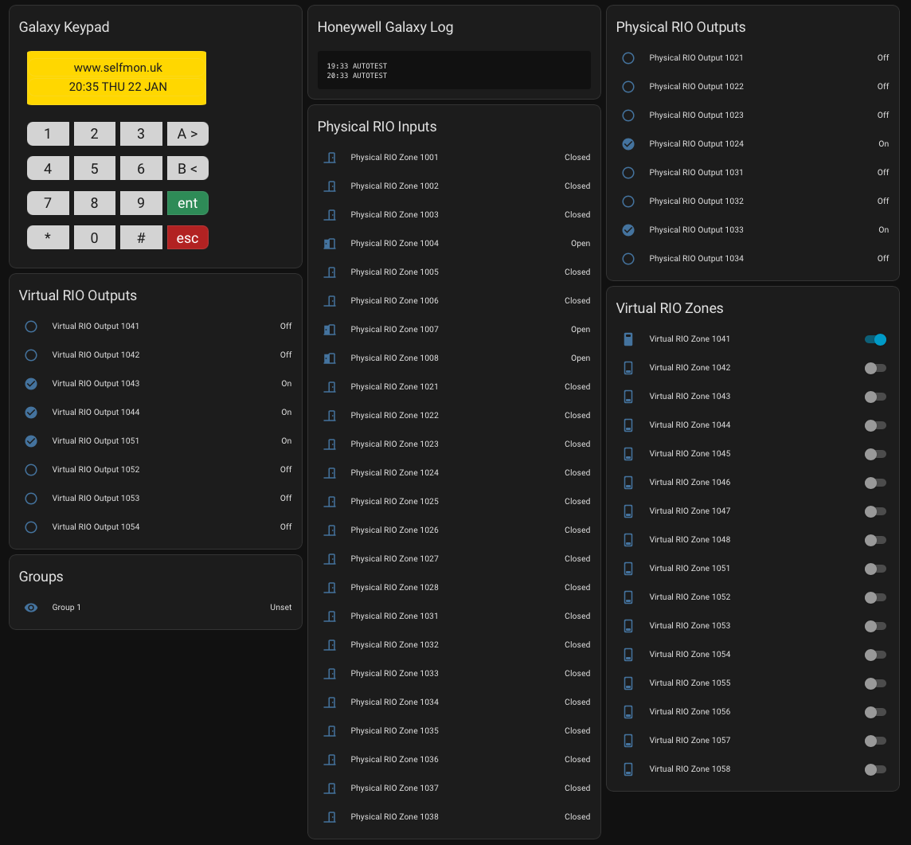

# Honeywell Galaxy Home Assistant Integration

This Home Assistant custom integration provides support for Honeywell Galaxy security alarms via MQTT using the
SelfMon VMOD available from http://www.selfmon.uk/sales/

## Credits

Jason Ball for the keypad card layout used in the optional Lovelace example

Guy Wells for the inspiration and his integration for the Galaxy with VMOD https://github.com./guybw/selfmon-HA


## Features

- **Virtual Keypad**: Display lines and 16-button interface as Home Assistant entities
- **Virtual Printer**: Sensor for printer log messages with print service
- **Virtual RIO Zones**: Switches to control virtual zones (OPEN/CLOSED)
- **Virtual RIO Outputs**: Binary sensors for virtual output states (On/Off)
- **Physical RIO Zones**: Binary sensors for physical zone states (door, motion, smoke, etc.)
- **Physical RIO Outputs**: Binary sensors for physical output states (On/Off)
- **Groups**: Sensors showing system group set status (Set, Unset, Part Set, Night Set)
- **Automatic Discovery**: Automatically discovers zones, outputs, and groups from MQTT topics
- **Device-based UI**: Entities are grouped into separate devices for use with modern Home Assistant dashboards

|   


## Requirements

Before installing this integration, ensure you have:

1. **MQTT Server**: A working MQTT broker (e.g., Mosquitto) configured in Home Assistant
2. **VMOD Installed**: The SelfMon VMOD installed and sensors and outputs triggered to populate the MQTT topic paths

No HACS custom cards are required. The integration exposes standard Home Assistant entities and devices.

## Installation

### HACS (Recommended)

1. Open HACS in Home Assistant
2. Go to "Integrations"
3. Click the three dots menu and select "Custom repositories"
4. Add this repository URL
5. Search for "Honeywell Galaxy" and install
6. Restart Home Assistant

### Manual Installation

1. Copy the `honeywell_galaxy` folder to your `custom_components` directory in Home Assistant
2. Restart Home Assistant
3. Go to Settings > Devices & Services
4. Click "Add Integration" and search for "Honeywell Galaxy"

## Configuration

1. Go to Settings > Devices & Services
2. Click "Add Integration"
3. Search for "Honeywell Galaxy"
4. Enter your MQTT connection details:
   - **Host**: MQTT broker hostname or IP address
   - **Port**: MQTT broker port (default: 1883)
   - **Protocol**: mqtt, mqtts, ws, or wss
   - **Username**: (optional) MQTT username
   - **Password**: (optional) MQTT password
   - **VMOD ID**: Your VMOD identifier

After configuration, the integration will automatically discover Physical RIO zones and outputs, Virtual RIO zones and outputs, and Groups from MQTT topics.

## Devices

Each integration instance creates a hub device and the following child devices under **Settings > Devices & Services > Honeywell Galaxy**:

| Device | Entities |
|--------|----------|
| **Honeywell Galaxy (vmodid)** | Hub / coordinator |
| **Virtual Keypad** | Display Line 1, Display Line 2, 16 keypad buttons |
| **Virtual Printer** | Printer Log (diagnostic) |
| **Physical RIO** | Discovered zone and output binary sensors |
| **Virtual RIO** | Discovered zone switches and output binary sensors |
| **Galaxy Groups** | Discovered group status sensors |

Add these devices to your dashboard using the standard Home Assistant UI:

1. Edit your dashboard
2. Add card → **By Device**
3. Select the device (e.g. Virtual Keypad, Physical RIO)
4. Choose the entities you want to display

This works with the default auto-generated dashboard and any custom dashboards.

## MQTT Topics

The integration uses the following MQTT topic structure:

- Virtual Keypad: `selfmon/vmod.{vmodid}/vkp`
  - Display Line 1: `selfmon/vmod.{vmodid}/vkp/display/line1`
  - Display Line 2: `selfmon/vmod.{vmodid}/vkp/display/line2`
  - Key Commands: `selfmon/vmod.{vmodid}/vkp/key`

- Virtual Printer: `selfmon/vmod.{vmodid}/vprinter`
  - Log Messages: `selfmon/vmod.{vmodid}/vprinter/log`
  - Print Commands: `selfmon/vmod.{vmodid}/vprinter/print`

- Virtual RIO Zones: `selfmon/vmod.{vmodid}/vrio/inputs/write/{zone_number}`
  - Commands: `OPEN` or `CLOSED`

- Virtual RIO Outputs: `selfmon/vmod.{vmodid}/vrio/outputs/{output_number}`
  - States: `ON` or `OFF`

- Physical RIO Zones: `selfmon/vmod.{vmodid}/prio/inputs/read/{zone_number}`
  - States: `OPEN` or `CLOSED`

- Physical RIO Outputs: `selfmon/vmod.{vmodid}/prio/outputs/{output_number}`
  - States: `ON` or `OFF`

- Virtual RIO Zones (Read): `selfmon/vmod.{vmodid}/vrio/inputs/read/{zone_number}`
  - States: `OPEN` or `CLOSED`

- Groups: `selfmon/vmod.{vmodid}/sia4/groups/{group_number}`
  - States: `Set`, `Unset`, `Part Set`, or `Night Set`

## Services

### `honeywell_galaxy.print_text`

Print text to the virtual printer.

**Service Data:**
- `text` (required): The text to print

**Example:**
```yaml
service: honeywell_galaxy.print_text
data:
  text: "Alarm triggered at {{ now() }}"
```

## Entities

After configuration, the integration automatically discovers and creates the following entities:

- **Sensors**:
  - Display Line 1 (Virtual Keypad device)
  - Display Line 2 (Virtual Keypad device)
  - Printer Log (Virtual Printer device, diagnostic)
  - Groups (Galaxy Groups device, one per discovered group)

- **Buttons**: 16 Virtual Keypad buttons (Virtual Keypad device)

- **Switches**: Virtual RIO zone switches (Virtual RIO device)

- **Binary Sensors**:
  - Physical RIO zones (Physical RIO device)
  - Physical RIO outputs (Physical RIO device)
  - Virtual RIO outputs (Virtual RIO device)

All entities are automatically discovered from MQTT topics — no manual configuration required.

## Keypad Interface

The Virtual Keypad device provides 16 buttons that match the physical keypad layout:
- **Row 1**: 1, 2, 3, A>
- **Row 2**: 4, 5, 6, B<
- **Row 3**: 7, 8, 9, Enter (green)
- **Row 4**: *, 0, #, Escape (red)

Each button press publishes the corresponding key value to the MQTT topic `selfmon/vmod.{vmodid}/vkp/key`.

Add the Virtual Keypad device to your dashboard to control the panel from Home Assistant.

### Optional Custom Keypad Card

For a keypad-style layout similar to the physical panel, an optional Lovelace card template is provided in `examples/lovelace_keypad_card.yaml`. This requires HACS custom cards (`button-card` and `stack-in-card`) and manual setup. Most users should use the standard device entities instead.

## Virtual RIO Zones

Virtual RIO Zones are controllable switches that allow you to set zones to OPEN or CLOSED. Each zone can be controlled individually — there is no master toggle to prevent accidental control of all zones at once.

## Troubleshooting

- **MQTT Connection Issues**: Check that your MQTT broker is accessible and credentials are correct
- **No Entities Appearing**:
  - Ensure your VMOD ID is correct and MQTT messages are being published
  - The integration automatically discovers entities from MQTT topics — wait up to 40 seconds after restart for discovery to complete
  - Check the Home Assistant logs for discovery messages
- **States Not Updating**: Check MQTT topic subscriptions match your VMOD configuration
- **Devices Not Showing**: Go to Settings > Devices & Services > Honeywell Galaxy and verify the child devices are listed
- **Printer Log Truncated**: The sensor state is limited to 255 characters, but the full log (up to 10 lines) is available in the `log_lines` attribute

## Development

This integration requires a Honeywell Galaxy alarm system fitted with SelfMon VMOD. It maintains compatibility with the VMOD MQTT topic structure.

### Automatic Discovery

The integration uses MQTT wildcard subscriptions to automatically discover:
- Physical RIO zones from `selfmon/vmod.{vmodid}/prio/inputs/read/+`
- Physical RIO outputs from `selfmon/vmod.{vmodid}/prio/outputs/+`
- Virtual RIO zones from `selfmon/vmod.{vmodid}/vrio/inputs/read/+`
- Virtual RIO outputs from `selfmon/vmod.{vmodid}/vrio/outputs/+`
- Groups from `selfmon/vmod.{vmodid}/sia4/groups/+`

Discovery runs for 10 seconds per category after integration setup.

## License

This integration is provided as-is for use with Honeywell Galaxy security systems.
